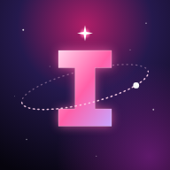

<p align="center"></p>

# Nova Index

**Everything the Nova suite remembers, in one place.** Part of the [Nova suite](https://github.com/tuniveza/nova-suite) for Novacane Studios.

Every Nova app hands its conversations to one shared memory. A tiny set of tagged, one-line facts comes out, kept in small files by subject. Before replying, each app reads back only the few files that matter for that turn. Nova Index is the window onto that memory: browse it, watch it grow, fix a line, and approve what's been learned about customers.

> The test for every fact: **"Would this still be true and useful in three months?"** If not, it isn't kept.

## What it does

- **Browse:** studio, staff and customer files as cards, grouped by who they're about. Filter by scope and search names, aliases and the facts themselves.
- **Edit:** open a file to change, add or delete a fact, its description or its aliases. Saving only goes through if nobody else has saved the file since you opened it. If someone has, you see both versions and can re-apply your edit in one tap.
- **Live:** what the suite has just learned, and which app learned it (NovaBot, Nova Agent, Nova Hub). It refreshes by itself.
- **Approve:** facts learned from customers wait here. One tap approves, edits or rejects each one. Nothing about a customer is kept without a person saying yes.

## How the memory works

```
- [stated]   said directly          "prefers evening sessions"
- [observed] seen in what happened  "usually books the Live Room"
- [inferred] a clear pattern        "books in the run-up to releases"
```

- **Scopes:**
  - `studio` (shared, including `public`, which customers may be told)
  - `staff` (one set per staff member)
  - `customer` (one set per client)

  The server decides who can see what:
  - Nova Agent: studio and staff memory.
  - The website's NovaBot: only that customer's file and the public studio facts.
  - Nova Hub and Nova Index (signed in): everything.
- **Paths:** `profile`, `people/<name>`, `topics/<subject>`, `areas/<name>`, `studio` and `public`.
- **Learning:**
  - Learning happens in the background, so no reply ever waits.
  - A small model pulls out only durable facts. Each file is then rewritten with the new facts folded in, never just added to.
  - Files that grow past about 3 KB are condensed.
  - Card, bank and ID numbers are never kept.
- **Reading:** each turn loads the studio file and the person's profile, plus at most three other files whose description matches, within a budget of about 800 tokens.

The memory engine runs on Nova Bot's worker (`src/memory/` in [nova-bot](https://github.com/tuniveza/nova-bot)). The memories live in its database, never in git. The full design is in [docs/spec.md](docs/spec.md).

## Where it runs

| Where | Address | What you can see |
|---|---|---|
| Nova Hub (signed in) | `https://novacane-worker.novacane-studio.workers.dev/app/memory/` | Everything, including approvals |
| Nova Agent (studio computer) | `http://localhost:4545/app/memory/` (inside Nova Agent's viewer) | Studio and staff memory; approvals open in Nova Hub |

This folder is the only real copy of the app. Nova Bot copies `app/` into its `public/app/memory/` on every deploy and local run (`scripts/sync-index.mjs`, wrangler's build step). Nova Agent serves it straight from here.

## Project layout

```
app/index.html          the page (sign-in, Browse, Live, Approve, Options)
app/memory.js           everything it does (no inline scripts: the page's security rules forbid them)
app/memory.css          the Nova suite look (colours from Nova Hub's shared themes)
app/manifest.webmanifest, app/icon*  the installable app and its cosmic "I"
docs/spec.md            the design: data model, API, extraction, retrieval, privacy
```

## Part of the Nova suite

[Nova Bot](https://github.com/tuniveza/nova-bot) · [Nova Agent](https://github.com/tuniveza/nova-agent) · [Nova Calendar](https://github.com/tuniveza/nova-calendar) · [Nova Notes](https://github.com/tuniveza/nova-notes) · [Nova Club](https://github.com/tuniveza/nova-club) · [Nova Observatory](https://github.com/tuniveza/nova-observatory) · **Nova Index**
