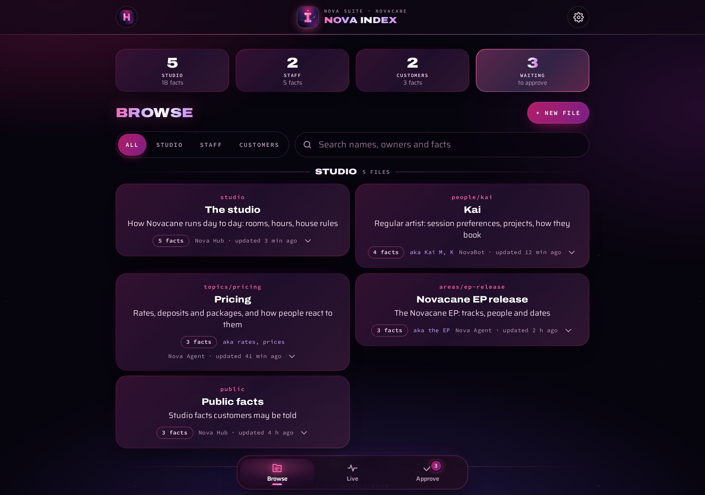
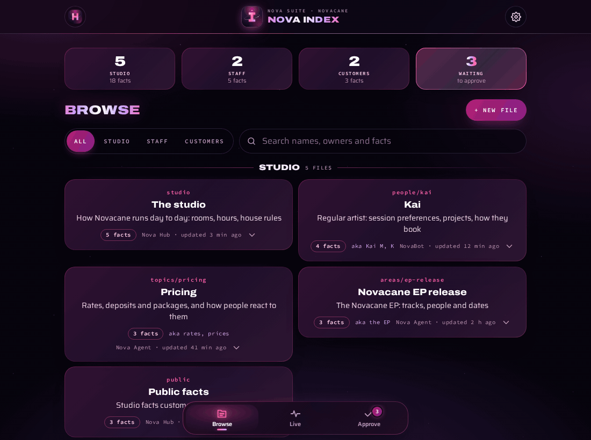
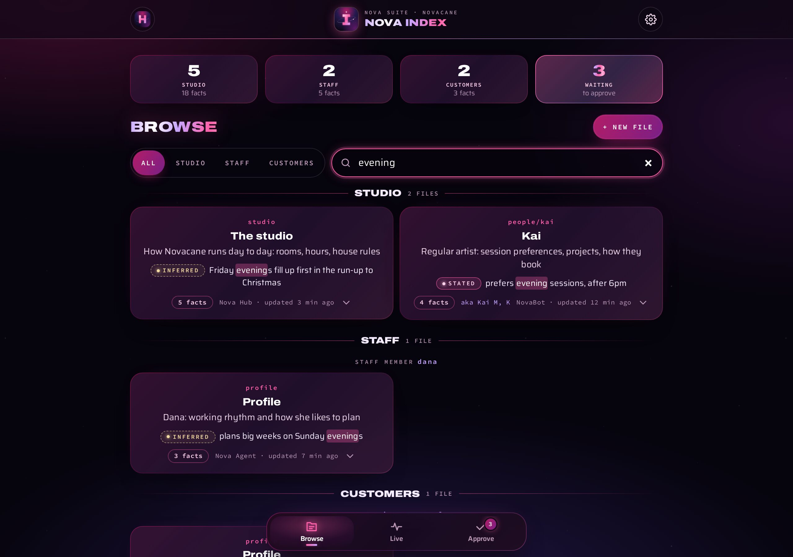
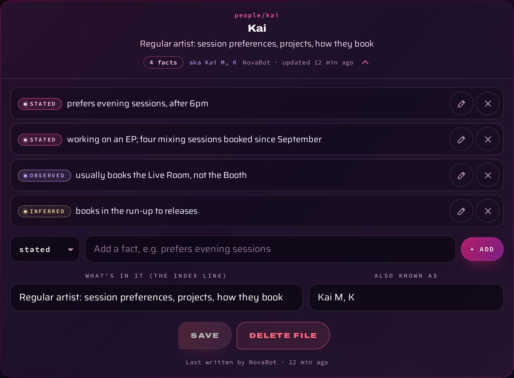
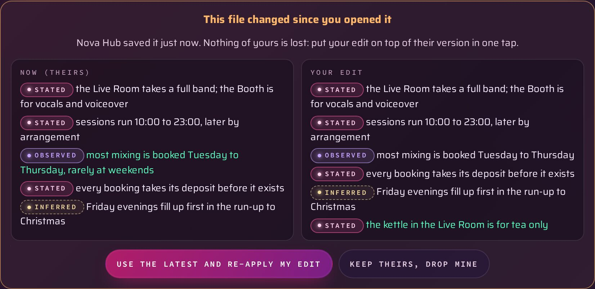
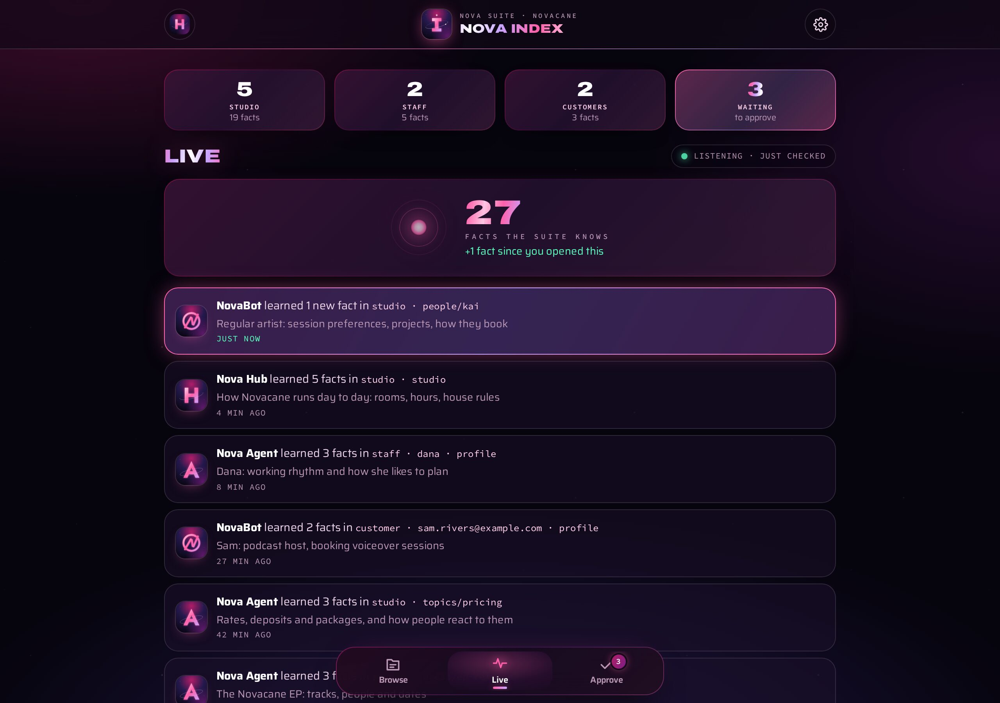
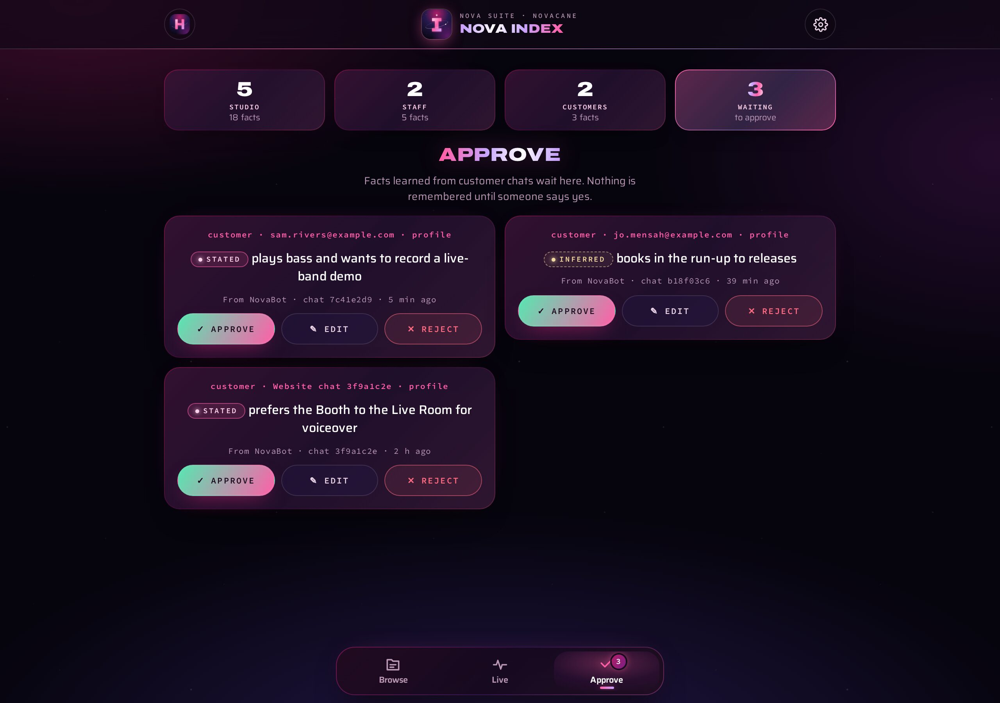

<div align="center">



# Nova Index

**Everything the Nova suite remembers, in one place.**<br>
Browse it, watch it grow, fix a line, and say yes or no to what's been learned about customers.

[](app/manifest.webmanifest)
[](app/memory.js)
[](https://github.com/tuniveza/nova-bot)
[](https://www.anthropic.com/claude)
[](https://github.com/tuniveza/nova-suite)

</div>

---

Every Nova app hands its conversations to one shared memory. A tiny set of tagged, one-line
facts comes out, kept in small files by subject. Before replying, each app reads back only the
few files that matter for that turn. Nova Index is the window onto that memory.

> The test for every fact: **"Would this still be true and useful in three months?"** If not, it isn't kept.

All the pictures here use made-up files and people.

<p align="center">
  <br>
  <sub>Open a file, add a fact, save; then approve a fact learned from a customer chat.</sub>
</p>

## What it does

### Browse

Studio, staff and customer files as cards, grouped by who they're about, with counts at the
top (tap one to jump to it). The **scope chips** (All, Studio, Staff, Customers) narrow it
down, and **search** looks through names, aliases, owners and descriptions, and inside the
facts themselves: a card shows the line that matched, with your words lit up.
**+ New file** starts one by hand.

<table>
  <tr>
    <td width="50%"></td>
    <td width="50%"></td>
  </tr>
  <tr>
    <td><sub><b>Search</b> finds facts, not just file names.</sub></td>
    <td><sub><b>An open file</b>: each fact with its tag pill, ready to edit.</sub></td>
  </tr>
</table>

### Edit, safely

Open a file to change, add or delete a fact (and its tag), its description (the line the apps
use to decide whether to read it) or its aliases. **Save** only goes through if nobody else has
saved the file since you opened it. If someone has, you see both versions side by side, with
the differences lit up, and can put your edit on top of theirs in one tap, or keep theirs.

<p align="center"></p>

### Live and Approve

<table>
  <tr>
    <td width="50%"></td>
    <td width="50%"></td>
  </tr>
  <tr>
    <td><sub><b>Live</b>: what the suite just learned, and which app learned it.</sub></td>
    <td><sub><b>Approve</b>: nothing about a customer is kept until someone says yes.</sub></td>
  </tr>
</table>

- **Live** shows what the suite has just learned, and which app learned it (NovaBot, Nova
  Agent, Nova Hub, Nova Index). It checks every 20 seconds while it's on screen, and anything
  new glows as it arrives. Tap a row to open the file.
- **Approve** holds facts learned from customers. One tap approves, edits or rejects each one.
  Nothing about a customer is kept without a person saying yes.
- **Options**: the theme (shared with Nova Hub), sound effects, refresh everything, open Nova
  Hub and sign out. It installs as an app, with the suite's cosmic "I".

## How the memory works

```
- [stated]   said directly          "prefers evening sessions"
- [observed] seen in what happened  "usually books the Live Room"
- [inferred] a clear pattern        "books in the run-up to releases"
```

| | |
|---|---|
| **Scopes** | `studio` (shared, including `public`, which customers may be told), `staff` (one set per staff member), `customer` (one set per client: their email, or a website chat until it's known) |
| **Paths** | `studio`, `public`, `profile`, `people/<name>`, `topics/<subject>`, `areas/<name>` |
| **Learning** | In the background, so no reply ever waits. A small model pulls out only durable facts; each file is then rewritten with them folded in, never just added to. Files past about 3 KB are condensed. Card, bank and ID numbers are never kept. |
| **Reading** | Each turn loads the studio file and the person's profile, plus at most three other files whose description or aliases match, within a budget of about 800 tokens |
| **Saving** | Every write carries the version it was based on; a clash returns the current file instead of overwriting it |

**Who sees what** is decided by the server, never by the app asking:

| Who | What they can see |
|---|---|
| Nova Agent (its key) | The studio's memory and staff memory; never customers' |
| The website's NovaBot | Only that customer's own file and the public studio facts |
| Nova Hub and Nova Index, signed in | Everything, including approvals |
| Staff signing in with Nova Portal (coming) | Staff who aren't admins: the studio's memory and their own; admins: everything |

Today Nova Index signs in with the studio's shared Nova Hub password. **Nova Portal**, one
sign-in for the whole suite, is coming: then each person sees what's theirs to see.

The memory engine runs on Nova Bot's worker (`src/memory/` in
[nova-bot](https://github.com/tuniveza/nova-bot)): the store, extraction and the API. The
memories live in its database, never in git. The full design is in [docs/spec.md](docs/spec.md).

## Where it runs

| Where | Address | What you can see |
|---|---|---|
| Nova Hub (signed in) | `https://novacane-worker.novacane-studio.workers.dev/app/memory/` | Everything, including approvals |
| Nova Agent (studio computer) | `http://localhost:4545/app/memory/` (inside Nova Agent's viewer) | Studio and staff memory; approvals open in Nova Hub |

This folder is the only real copy of the app. Nova Bot copies `app/` into its
`public/app/memory/` on every deploy and local run (`scripts/sync-apps.mjs`, wrangler's build
step). [Nova Agent](https://github.com/tuniveza/nova-agent) serves it straight from here, and
reaches the memory through its own key.

The page talks only to `/app/api/memory/` on its own site (`index`, `file`, `pending`,
`stats`), so it needs no settings of its own. To try it locally, run Nova Bot's worker
(`npm run dev` in `novacane-worker`) and open `/app/memory/`, or open it inside Nova Agent.

## Project layout

```
app/index.html          the page (sign-in, Browse, Live, Approve, Options)
app/memory.js           everything it does (no inline scripts: the page's security rules forbid them)
app/memory.css          the Nova suite look (colours from Nova Hub's shared themes)
app/manifest.webmanifest, app/icon*  the installable app and its cosmic "I"
docs/spec.md            the design: data model, API, extraction, retrieval, privacy
docs/media/             README images
```

## Part of the Nova suite

| Project | What it is |
|---|---|
| [nova-suite](https://github.com/tuniveza/nova-suite) | The Nova suite: an overview of every project |
| [nova-bot](https://github.com/tuniveza/nova-bot) | The website chat assistant, Nova Hub, and the memory engine |
| [nova-agent](https://github.com/tuniveza/nova-agent) | The chat and planner on the studio computer, and the Acuity helper |
| **[nova-index](https://github.com/tuniveza/nova-index)** | This repo: everything the suite remembers, browsable |
| [nova-club](https://github.com/tuniveza/nova-club) | Members' Android app |
| [nova-calendar](https://github.com/tuniveza/nova-calendar) | A cosmic calendar of note cards and day cards |
| [nova-notes](https://github.com/tuniveza/nova-notes) | A note editor that writes from the centre outwards |
| [nova-observatory](https://github.com/tuniveza/nova-observatory) | A dashboard of every project |
